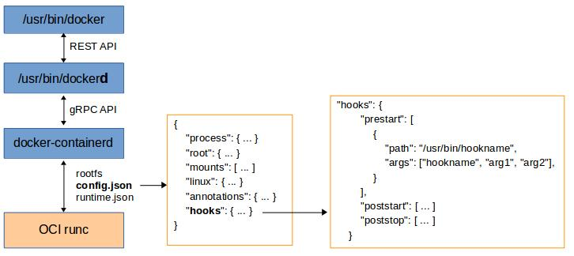
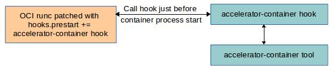

# accelerator-container-runtime

Copyright 2019 b<>com

## Presentation

The accelerator-container-runtime plugin enables deployment of hardware accelerated applications into docker containers.

## Dockerfile environment variables

The Dockerfile will contain environment variables defining the acceleration resources needed by the container.

### `ACCELERATOR_DEVICES`

Comma separated list of accelerator devices to be made accessible inside the container. Each device may be defined by:

- pci bus:device.function identifier,
- fpga driver slot index 0, 1, ...

The special value `"all"` will attach all available accelerator devices.

Ex : `ENV ACCELERATOR_DEVICES "06:00.0"`

#### `ACCELERATOR_FUNCTIONS`

Expected acceleration function(s) provided by the device(s). If only one function name is provided, all devices should contain this function. If a list of function names is provided, first function is associated to first device, second function to second device, ...

Ex : `ENV ACCELERATOR_FUNCTIONS nlb0`

#### `ACCELERATOR_REQUIRE_*`  (not implemented yet)

Indicate version constraints on the acceleration components. Ex :

```shell
ENV ACCELERATOR_REQUIRE_INTEL_DRIVER >= 1.0
ENV ACCELERATOR_REQUIRE_INTEL_OPAE >= 1.1
```

## Docker integration

To instantiate a new container, the docker client forwards the request to the docker daemon (dockerd). The daemon relies then on the `runc` runtime process to spawn the container.

`runc`, maintained by the Open Containers Initiative (OCI), is a tool for spawning and running containers according to the OCI specification. This specification defines the `runc` interface comprising the root FS path and 2 json files for configuration and runtime settings.

The configuration specification supports hooks for configuring custom actions related to the lifecycle of the container :

- Prestart : called after the start operation is called but before the user-specified program command is executed.
- Poststart : called after the user-specified process is executed but before the start operation returns.
- Poststop : called after the container is deleted but before the delete operation returns.



The accelerator-container plugin needs to customize the container before it gets started, so the plugin should be interfaced to Docker through a prestart hook.

BUT for now, the docker daemon does not manage the OCI specs hooks, ie there is no way to configure these hooks. The solution is to patch the runc program with the static addition of the accelerator-container hook to the list of prestart hooks. So the plugin will be made of 3 components :

- `accelerator-container-runtime` : the patched runc program which will be used as docker runtime instead of `runc`.
- `accelerator-container-runtime-hook` : the hook program called by the runtime each time it starts a container. This hook is written in Go.
- `accelerator-container-runtime-tool` : the C program called by the hook implements all the container customization.



Configure new runtime into Docker daemon config `/etc/docker/daemon.json`

```json
{
  "runtimes": {
      "accelerator": {
          "path": "/usr/bin/accelerator-container-runtime",
          "runtimeArgs": []
      }
  }
}
```

To configure the accelerator runtime as default runtime, add `"default-runtime": "accelerator"` to the config.


## Loading of function bitstream

For each requested device, the runtime tool checks whether the accelerator already contains the expected function, otherwise it loads automatically the function bistream to the accelerator device based on the `acceleration.json` config (see `config.md`).


## Host setup

The runtime tool first tunes devices file nodes and sysfs entries, so the devices get accessible from any user.

- Intel devices

```shell
  chmod 666 /dev/intel-fpga-port.<slotid>
  chmod 666 /sys/class/fpga/intel-fpga-dev.*/intel-fpga-port.<slotid>/userclk_freqcmd
  chmod 666 /sys/class/fpga/intel-fpga-dev.*/intel-fpga-port.<slotid>/userclk_freqcntrcmd
  chmod 666 /sys/class/fpga/intel-fpga-dev.*/intel-fpga-port.<slotid>/errors/clear
```

- Xilinx AWS devices

```shell
  chmod 666 /dev/xdma<slotid>_*
  chmod 666 /sys/bus/pci/devices/0000:<accelerator bdf>/resource*
  chmod 666 /sys/bus/pci/devices/0000:<manager bdf>/resource*
```


## Container setup

This section explains how the runtime tool customizes the container. The actions are illustrated with shell commands but are in fact implemented in C source code.

### Attach devices nodes

Add devices to allowed devices cgroup, ex  `echo c 243:0 rwm > /sys/fs/cgroup/devices/devices.allow`

Mount bind device node special file from host FS to container FS:

- Intel devices   `mount --bind /dev/intel-fpga-port.0 <container rootFS path>/dev/intel-fpga-port.0`
- Xilinx AWS devices   `for dev in /dev/xdma<slotid>*; do  mount --bind  $dev  <container rootFS path>/$dev; done`

#### Limit memory usage resources

The Intel OPAE library allocates its buffers using Linux HugePages 2MB and 1GB. By default a container has access to all configured system hugepages but a good practice is to limit these resources. Ex for a function requiring 5 hugepages2MB :

```shell
cgpath = get container cgroup path from /proc/<container pid>/cgroup
echo 10M > "/sys/fs/cgroup/hugetlb/<cgpath>/hugetlb.2MB.limit_in_bytes"
```

Moreover OPAE locks the allocated hugepages in memory to guarantee the pages are never swapped to disk. By default a container memory lock limit is 64 KB, so it has be increased. Ex  `prlimit --pid <container pid> --memlock=10485760:10485760`

#### Mount host directories

Every Xilinx SDAccel application needs access to the Xilinx real-time kernel, so the RTE host directory is bind mounted into the container. Ex  `mount --bind /opt/Xilinx/SDx/2017.1.rte.4ddr  <container rootFS path>/opt/Xilinx/SDx/rte`

#### Attach host libraries

Intel OPAE library is highly correlated to Intel FPGA driver. Intel releases driver and library packages at the same time, using same version for both.
Usually libraries are reinstalled within the container but to guarantee coherency between FPGA driver and OPAE library, the solution is to refer to host OPAE library from the container inside. Ex  `mount --bind /lib/libopae-c.so.0.13.0  <container rootFS path>/lib/libopae-c.so.0.13.0`


## Compilation and installation

Required packages:

- docker-ce >= 17.12.0

Generate distribution packages for centos7 (rpm), ubuntu16.04 (deb) and debian9 (deb) in `dist/` directory:

```shell
make
```

Due to `runc` patch, generation depends on docker-ce version. For now it manages only one docker version at a time: to generate packages for another docker version, patch `DOCKER_VERSION` and `DOCKER_PATCH` into `Makefile`.

## Configuration

The accelerator-container configuration is defined into the JSon file `acceleration.json` installed to the `/etc` directory.

Below is a detailed description of each configuration section.

### global

* **loglevel** specifies the runtime-tool log level. Values are either `error` or `info` or `debug`.

```json
{
  "global": {
    "loglevel": "info"
  }
}
```

### accelerationFunctions

An array of all acceleration functions to be managed by the runtime-tool.

* **name** is the acceleration function name
* **description** is an optional acceleration function description

```json
{
  "accelerationFunctions" : [
    { "name": "nlb3",    "description": "Intel Loopback Adapter for fpga_diag" },
    { "name": "sha512",  "description": "Compute SHA 512" }
  ]
}
```

### acceleratorEngines

An array of all accelerator engines to be managed by the runtime-tool. For now, two engines are defined:

* `IntelOPAE`  Intel Programmable Acceleration Card with Intel Arria 10 GX FPGA, controlled by the Open Programmable Acceleration Engine (OPAE) software.
* `XilinxAWS`  AWS F1 instance with Xilinx FPGA.


* **name** is the accelerator engine name.
* **bitstreamLocation** sets the host directory containing all the acceleration functions bitstream files. Note that this field has no meaning for XilinxAWS as the bitstreams are provided by Amazon infrastructure.
* **partialConfigPhysfn** is a true/false flag indicating whether an accelerator PCIe physical function is reconfigurable with a new bitstream.
* **partialConfigVirtfn** is a true/false flag indicating whether an accelerator PCIe virtual function is reconfigurable with a new bitstream.
* **activateSriov** is a true/false flag indicating whether SR-IOV is configured.
* **xilinxSdxRTE** is specific to Xilinx AWS FPGAs and contains the path of the Xilinx RTE kernel.

```json
{
  "acceleratorEngines": [
    {
      "name": "IntelOPAE",
      "bitstreamLocation": "/usr/lib/bitstream/intel",
      "partialConfigPhysfn": true,
      "partialConfigVirtfn": false,
      "activateSriov": false,
    }
  ]
}
```

#### functions

Inside each accelerator engine, an array of functions lists all functions supported by the engine. Each function comes with some parameters related to the function handling by the engine and its software.

* **name** is the acceleration function name as defined in the accelerationFunctions section.
* **hwID** is the acceleration function identifier for the engine, eg AFU ID for Intel, gAFI ID for AWS.
* **hugepage2M** sets the number of hugepages 2MB required by the acceleration software.
* **hugepage1G** sets the number of hugepages 1GB required by the acceleration software.
* **bistreamFile** is the acceleration functions bitstream file name. This file should be located into the bitstreamLocation directory. Note that this field has no meaning for XilinxAWS as the bitstreams are provided by Amazon infrastructure.

```json
{
  "acceleratorEngines": [
    {
      "functions": [
        { "name": "nlb0", "hwID": "d8424dc4-a4a3-c413-f89e-433683f9040b", "hugepage2M": 3, "hugepage1G": 0, "bistreamFile": "nlb_mode_0.gbs" },
        { "name": "nlb3", "hwID": "f7df405c-bd7a-cf72-22f1-44b0b93acd18", "hugepage2M": 2, "hugepage1G": 2, "bistreamFile": "nlb_mode_3.gbs" }
    }
  ]
}
```

## About

This project has received funding from the European Union’s H2020-ICT-2016-2017 Programme under grant agreement n° 761557

